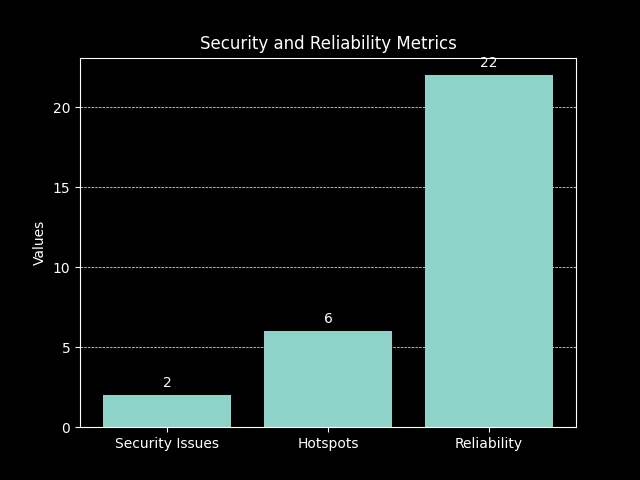
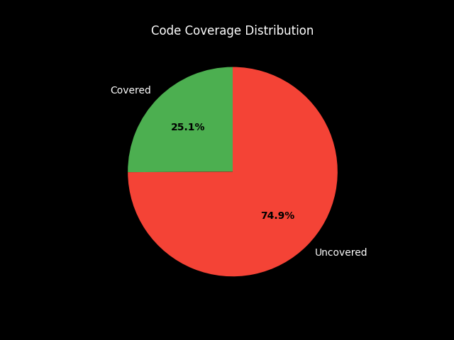

# Statistical Code Review

## Overview

This document provides a review of the statistical code used in our project. The review focuses on the following areas:
1. **Code Structure and Organization**: Evaluating how well the code is organized, including the use of functions, classes, and modules to enhance readability and maintainability.
2. **Statistical Methods and Techniques**: Assessing the appropriateness and correctness of the statistical methods and techniques implemented in the code.
3. **Data Handling and Preprocessing**: Reviewing how data is handled, including data cleaning, transformation, and preparation for analysis.
4. **Performance and Efficiency**: Analyzing the performance of the code, including computational efficiency and scalability.

### Tools used

- SonarQube
- CheckStyle
- PMD

## Metrics Summary

### Overview

| Metric                      | Issues | Rating   |
|-----------------------------|--------|----------|
| Code Maintainability Index  | 143    | Good     |
| Code Security Issues        | 2      | Poor     |
| Security Hotspots           | 6      | Poor     |
| Reliability Rating          | 22     | Moderate |

**Interpretation:**
- High Risk: Security Hotspots, Code Security Issues
- Medium Risk: Reliability Rating
- Low Risk: Maintainability

Improving code security and fixing security hotspots should be a high priority as they will improve the overall security of the application. (Recommendation: Make DB pass an environment variable so it isn't compromised. Do not enable debugging features on production servers or applications distributed to end users.)
The reliability of the code should be improved to ensure that the application is reliable and can handle unexpected errors with proper error handling.

### Cyclomatic Complexity

| Metric             | Value |
|--------------------|-------|
| Total              | 793   |
| Number of methods  | 288   |
| Average per method | 2.75  |

**Interpretation:**
The average cyclomatic complexity per method is 2.75, which is low and indicates that the code is easy to understand and maintain.

### Lines of code per method

| Metric              | Value |
|---------------------|-------|
| Total LOC           | 4334  |
| Per method          | 15.05 |

**Interpretation:**
The average lines of code per method are 15 lines, which indicates that the code is overall well-structured and modular.

### Duplications

| Metric              | Value  |
|---------------------|--------|
| Density             | 5.3%   |
| Duplicated Lines    | 282    |
| Duplicated Blocks   | 19     |
| Duplicated Files    | 10     |

**Interpretation:**
The code is moderately duplicated, indicating that refactoring is needed to reduce the duplication to make the code more maintainable and scalable.

### Coverage

| Metric           | Value |
|------------------|-------|
| Total Coverage   | 24.9% |
| Line Coverage    | 25.1% |
| Lines to Cover   | 2919  |
| Uncovered Lines  | 2187  |

**Interpretation:**
The code coverage is low, indicating that more tests should be implemented for a higher level of line coverage.

