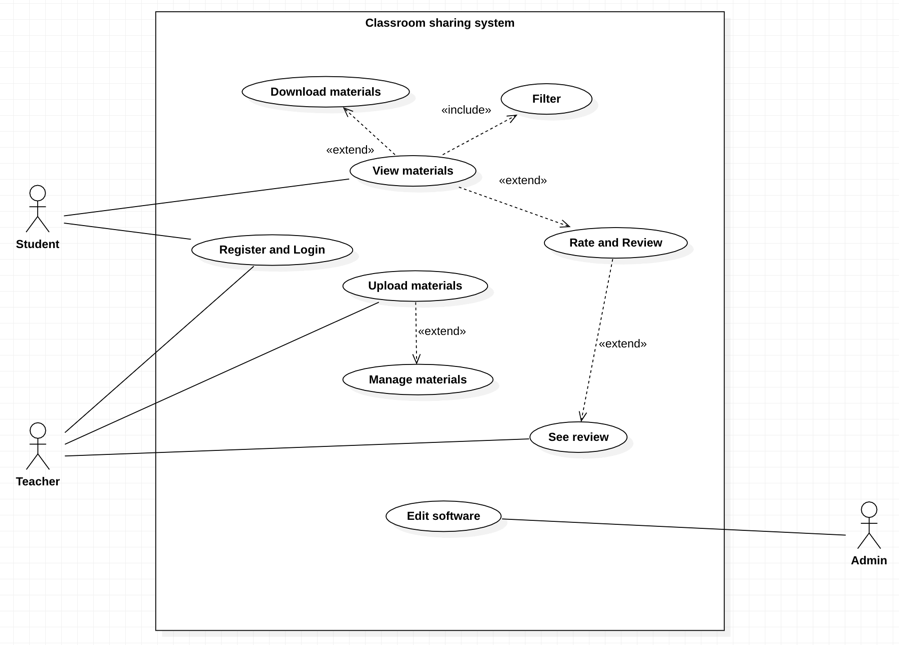

# Classroom sharing system
ohjelmistotuotanto projekti 1 repo

sprint2: https://trello.com/b/2XyOSUYe/sprint2

published jacoco report: https://users.metropolia.fi/~aleklap/Aleksi246%20OTP1_G9%20main%20target-site_jacoco/

Use case diagram:

Use "mvn clean javafx:run" in terminal to run the application.
