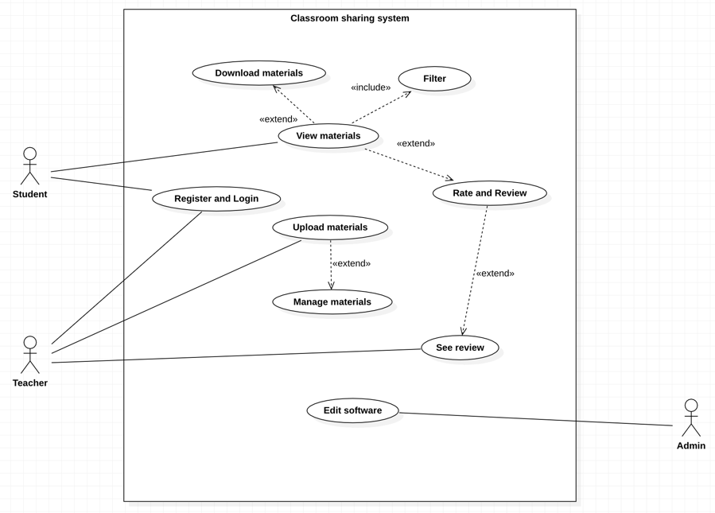

# Classroom Sharing System

## Project Description

The Classroom Sharing System is a comprehensive application designed to facilitate resource sharing and collaboration within educational institutions. This system enables students and instructors to share course materials, collaborate on projects, and manage classroom resources efficiently. The application features user authentication, role-based access control, material management, and review capabilities to promote a collaborative learning environment.

## Technology Stack

### Backend
- **Language:** Java
- **Framework:** Spring Boot
- **Build Tool:** Maven
- **Database:** MariaDB
- **Testing:** JUnit, Mockito
- **Code Coverage:** JaCoCo
- **CI/CD:** Jenkins

### Frontend
- **Framework:** JavaFX
- **Language:** Java

### DevOps & Deployment
- **Containerization:** Docker
- **Container Registry:** Docker Hub
- **Version Control:** Git/GitHub

## Architecture Design

### Use Case Diagram
The system supports the following primary use cases:



The use case diagram depicts the key interactions between actors (Students, Instructors, Administrators) and the system, including:
- User authentication and profile management
- Material upload and sharing
- Course enrollment and management
- Review and feedback mechanisms
- Resource discovery and access control

### Entity-Relationship Diagram
The database architecture is modeled through an ER diagram that defines the relationships between core entities:


The ER diagram illustrates the logical structure of the database, including:
- **Users:** Student and instructor accounts with authentication credentials
- **Courses:** Course definitions with metadata and enrollment information
- **Materials:** Shareable resources attached to courses
- **Reviews:** Feedback and ratings on materials and contributions
- **Participants:** Enrollment records linking users to courses

## Sprint Reports

For detailed information about project progress, sprint planning, and reviews, visit the [Sprint Reports Folder](Documents/sprint_reports/).

- [Sprint 1 Review](Documents/sprint_reports/sprint1_review_report.md)
- [Sprint 2 Planning](Documents/sprint_reports/sprint2_planning_report.md)
- [Sprint 2 Review](Documents/sprint_reports/sprint2_review_report.md)
- [Sprint 3 Planning](Documents/sprint_reports/sprint3_planning_report.md)
- [Sprint 3 Review](Documents/sprint_reports/sprint3_review_report.md)
- [Sprint 4 Planning](Documents/sprint_reports/sprint4_planning_report.md)

## Getting Started

### Prerequisites
- Java 11 or higher
- Maven 3.6+
- MariaDB 10.4+
- Docker (optional, for containerized deployment)

### Running the Application

#### Using Maven
```bash
# Run with JavaFX
mvn clean javafx:run

# Run without running tests (faster)
mvn -DskipTests javafx:run
```

#### Using Docker??
```bash
# Build the Docker image
docker build -t classroom-sharing-system:latest .

# Run the container
docker run -d classroom-sharing-system:latest
```

## Additional Resources

- **Published JaCoCo Report:** https://users.metropolia.fi/~aleklap/Aleksi246%20OTP1_G9%20main%20target-site_jacoco/
- **Sprint 2 Trello Board:** https://trello.com/b/2XyOSUYe/sprint2

## Team

This project is developed as part of the Software Development Project 1 course at Metropolia University of Applied Sciences.
