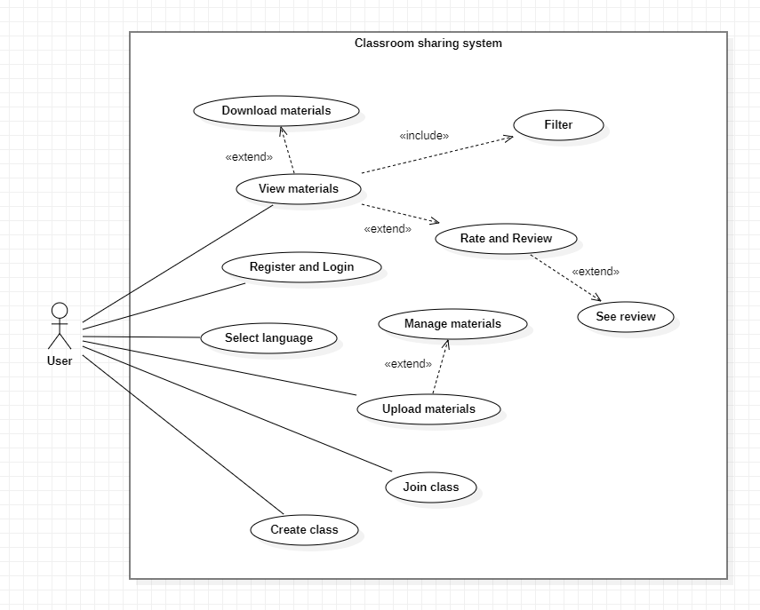
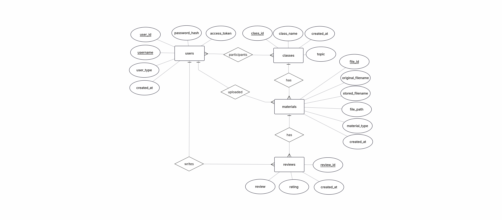

# Classroom Sharing System

## Project Description

The Classroom Sharing System is a comprehensive application designed to facilitate resource sharing and collaboration within educational institutions. This system enables students and instructors to share course materials, collaborate on projects, and manage classroom resources efficiently. The application features user authentication, role-based access control, material management, and review capabilities to promote a collaborative learning environment.

**The application supports multiple languages** including English, French, Russian, and Persian (Farsi) with full RTL (Right-to-Left) support for Persian.

## Technology Stack

### Backend
- **Language:** Java 21
- **Framework:** Spring Boot
- **Build Tool:** Maven 3.6+
- **Database:** MariaDB 10.4+
- **Testing:** JUnit 5, Mockito
- **Code Coverage:** JaCoCo
- **CI/CD:** Jenkins

### Frontend
- **Framework:** JavaFX 21.0.6
- **Language:** Java 21
- **UI Components:** FXML with CSS styling

### DevOps & Deployment
- **Containerization:** Docker
- **Container Registry:** Docker Hub
- **Version Control:** Git/GitHub

## Architecture Design

### Use Case Diagram
The system supports the following primary use cases:



The use case diagram depicts the key interactions between actors (Students, Instructors, Administrators) and the system, including:
- User authentication and profile management
- Material upload and sharing
- Course enrollment and management
- Review and feedback mechanisms
- Resource discovery and access control

### Entity-Relationship Diagram
The database architecture is modeled through an ER diagram that defines the relationships between core entities:



The ER diagram illustrates the logical structure of the database, including:
- **Users:** Student and instructor accounts with authentication credentials
- **Courses:** Course definitions with metadata and enrollment information
- **Materials:** Shareable resources attached to courses
- **Reviews:** Feedback and ratings on materials and contributions
- **Participants:** Enrollment records linking users to courses

## Project Documentation & Sprint Reports

For detailed information about project progress, sprint planning, and architectural decisions, visit the [Sprint Reports Folder](Documents/sprint_reports/):

- [Sprint 1 Review](Documents/sprint_reports/sprint1_review_report.md)
- [Sprint 2 Planning](Documents/sprint_reports/sprint2_planning_report.md)
- [Sprint 2 Review](Documents/sprint_reports/sprint2_review_report.md)
- [Sprint 3 Planning](Documents/sprint_reports/sprint3_planning_report.md)
- [Sprint 3 Review](Documents/sprint_reports/sprint3_review_report.md)
- [Sprint 4 Planning](Documents/sprint_reports/sprint4_planning_report.md)
- [Sprint 5 Planning](Documents/sprint_reports/sprint5_planning_report.md)
- [Sprint 5 Review](Documents/sprint_reports/sprint5_review_report.md)
- [Sprint 6 Planning](Documents/sprint_reports/sprint6_planning_report.md)

## Getting Started

### Prerequisites
- Java 21 or higher
- Maven 3.6+
- MariaDB 10.4+
- Docker (optional, for containerized deployment)

### Installation & Setup

1. **Clone the repository:**
   ```bash
   git clone <repository-url>
   cd OTP1_G9
   ```

2. **Configure database connection:**
   - Update database credentials in the application properties file if needed
   - Initialize the database using the provided `init.sql` script:
     ```bash
     mysql -u <username> -p < init.sql
     ```

### Running the Application

#### Option 1: Using Maven (Recommended)
```bash
# Clean build and run with JavaFX
mvn clean javafx:run

# Run without running tests (faster development)
mvn -DskipTests javafx:run

# Run tests and generate code coverage report
mvn clean test jacoco:report
```

#### Option 2: Using Docker Compose (macOS & Windows)
```bash
# Start the database + app, and build the local image if needed
docker compose up --build
```

The Compose file now builds the app locally and connects it to the database service automatically, so you do not need separate `docker build` or `docker run` commands.

Before first run, make sure your host X server is ready:

- **macOS:** install/open **XQuartz**, then run `xhost + 127.0.0.1`
- **Windows:** start **VcXsrv** or **Xming** and allow local connections


Useful commands:
```bash
# Follow logs
docker compose logs -f

# Stop containers
docker compose down
```

## Language Selection & Localization

The application supports **4 languages** that can be switched seamlessly within the application:

| Language | Code | Default | RTL Support |
|----------|------|---------|-------------|
| English | `en` | ✓ | ✗ |
| Français (French) | `fr` | | ✗ |
| Русский (Russian) | `ru` | | ✗ |
| فارسی (Persian/Farsi) | `fa` | | ✓ |

### Localization Implementation

- Localization and translation work was assisted with GitHub Copilot during development.
- UI text is externalized with Java `ResourceBundle` property files in `src/main/resources/com/example/app/`:
  - `messages.properties` (default)
  - `messages_fr.properties`
  - `messages_ru.properties`
  - `messages_fa.properties`
- Bundles are loaded through `LocaleManager.getBundle()` in `src/main/java/com/example/app/LocaleManager.java` using UTF-8 support.

### Selecting a Language at Runtime

1. **Launch the Application:**
   - Run the application using Maven or Docker
   - The application starts in English by default

2. **Change Language:**
   - After logging in, locate the **language selector dropdown** in the top navigation bar
   - Click the dropdown to view all available languages
   - Select your preferred language from the list:
     - **English** (English)
     - **Français** (French)
     - **Русский** (Russian)
     - **فارسی** (Persian/Farsi with RTL support)
   - The entire application UI will instantly update to display content in the selected language

3. **Language Features:**
   - **English** - Full translations for all UI elements, messages, and dialogs
   - **French** - Complete French localization with proper accents and formatting
   - **Russian** - Complete Russian localization with Cyrillic text support
   - **Persian (Farsi)** - Complete localization with Right-to-Left (RTL) text direction and bidirectional text support

### Adding New Languages

To add a new language to the application:

1. **Create translation file:**
   Create a new properties file in `src/main/resources/com/example/app/` with UTF-8 encoding:
   ```
   messages_<language-code>.properties
   Example: messages_de.properties for German
   ```
   Copy all keys from `messages.properties` and provide translations.

2. **Update TopBarController.java:**
   Modify the initialize method to include the new locale:
   ```java
   languageChoiceBox.getItems().setAll(
       Locale.ENGLISH, 
       Locale.FRENCH, 
       new Locale("fa"), 
       new Locale("ru"),
       new Locale("de")  // Add your new locale here
   );
   ```

3. **Add display name:**
   Update the `StringConverter` in the same file:
   ```java
   case "de" -> "Deutsch";
   ```

4. **Handle RTL (if needed):**
   If your language reads right-to-left, update `LocaleManager.isRightToLeft()`:
   ```java
   public static boolean isRightToLeft() {
       return currentLocale != null && ("fa".equals(currentLocale.getLanguage()) || "ar".equals(currentLocale.getLanguage()));
   }
   ```

5. **Rebuild and test:**
   ```bash
   mvn clean javafx:run
   ```

## Build & Deployment Status

- **CI/CD Pipeline:** Jenkins integration active
- **Code Quality:** Continuous testing with JUnit 5 and code coverage tracking
- **Published JaCoCo Coverage Report:** https://users.metropolia.fi/~aleklap/Aleksi246%20OTP1_G9%20main%20target-site_jacoco/

## Additional Resources

- **Published JaCoCo Report:** https://users.metropolia.fi/~aleklap/Aleksi246%20OTP1_G9%20main%20target-site_jacoco/
- **Database Initialization Guide:** See [DB_INIT_GUIDE.md](DB_INIT_GUIDE.md)
- **Project Management:** Trello Board - https://trello.com/b/JAtHGqiA/sprint5

## Troubleshooting

### Common Issues

**Issue: Application won't start with JavaFX**
- Ensure Java 21 is installed: `java -version`
- Check that your platform is correctly set in pom.xml (mac-aarch64 for Apple Silicon, mac for Intel)
- Try cleaning Maven cache: `mvn clean`

**Issue: Database connection fails**
- Verify MariaDB is running
- Check database credentials in application properties
- Ensure the init.sql script has been executed

**Issue: Language not changing**
- Make sure you're logged in before accessing the language selector
- Check that the .properties file exists for the selected language
- Rebuild and restart the application if language files were modified

## Requirements

- **Minimum Java Version:** Java 21
- **Build System:** Maven 3.6 or later
- **Database:** MariaDB 10.4 or later
- **Operating Systems:** Windows, macOS (Intel & Apple Silicon), Linux
- **Display Resolution:** Minimum 1280x720 recommended

## Contributing

When contributing to this project:

1. Follow the existing code style and conventions
2. Add/update tests for new features
3. Ensure code coverage remains above current level (check with `mvn jacoco:report`)
4. Update documentation for significant changes
5. Create descriptive commit messages
6. Reference sprint reports when applicable
